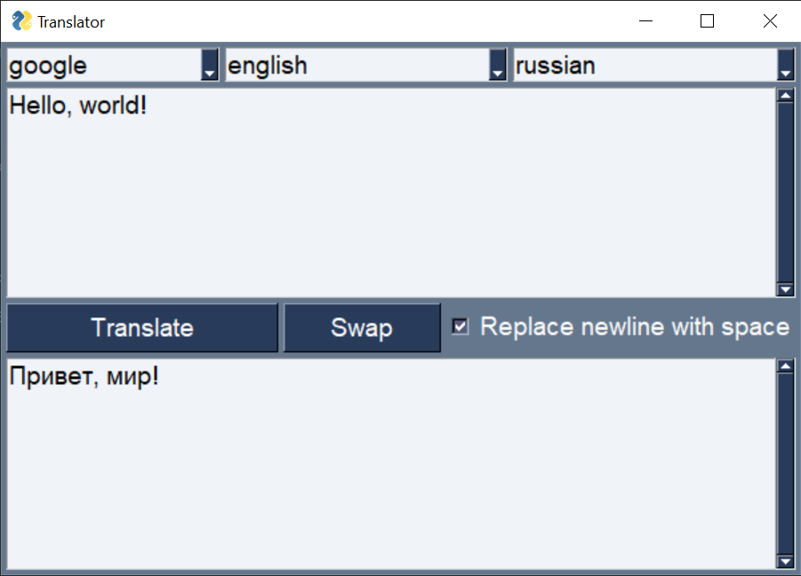

# Text Translator

```
python -m venv venv
venv\Scripts\activate
pip install -r requirements.txt
pyinstaller --noconfirm --onefile app.py
dist\app.exe
```

</img>

```
usage: app [-h] [-t [theme]] [-bf [button_font]] [-tf [text_font]]
           [-lf [language_from]] [-lt [language_to]] [--nl2sp] [--show-themes]
           [--selected-text] [--from-clipboard]
           [text ...]

Text translator

positional arguments:
  text                  example: app <text>

options:
  -h, --help            show this help message and exit
  -t [theme], --theme [theme]
                        PySimpleGUI theme
  -bf [button_font], --button-font [button_font]
                        button font, default: "'Arial' 12"
  -tf [text_font], --text-font [text_font]
                        text font, default: "'Lucida Console' 12"
  -lf [language_from], --language-from [language_from]
                        source language, ex. "english" or "en", default: "auto"
  -lt [language_to], --language-to [language_to]
                        target language, ex. "russian" or "ru", default: "ru"
  --nl2sp               replace newline with space
  --show-themes         show PySimpleGUI themes
  --selected-text       emulates pressing Ctrl+C and gets the text to be translated from the clipboard (previous clipboard text data is restored)
  --from-clipboard      gets the text to be translated from the clipboard

examples:
    app --show-themes
    app --selected-text
    app -bf Arial -tf "Lucida Console" -lf En -lt Ru Hello, world!
    app -t Default -bf "Arial 13" -tf "Lucida Console 13" -lf English -lt Russian --nl2sp Hello, world!
    app --theme Default --button-font "Arial 13" --text-font "'Lucida Console' 13" --language-from English --language-to Russian --nl2sp Hello, world!
    app -t Default -bf "Roboto,arial,sans-serif 12" -tf "Roboto,RobotoDraft,Helvetica,Arial,sans-serif 12" -lf English -lt Russian --nl2sp Hello, world!
```

---

You can create a shortcut (.lnk) to the .exe file, specify the properties:
- Object: `<path> --from-keyboard`
- Hotkey
- Window Minimized

You can create a VBScript to run without the console: `translator.vbs`
```
CreateObject("Wscript.Shell").Run "app.exe --from-clipboard", 0, True
```
